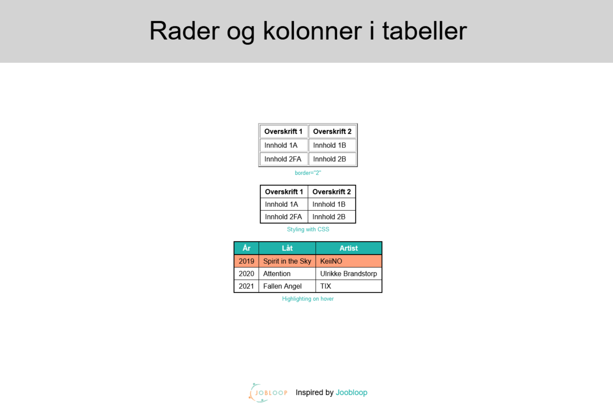

# Rader og kolonner i tabeller 
https://github.com/chriskodehub/3-KH_rader-kolonner-tabeller

## Oppgave 1
Skriv av koden under og prøv den først som den er i nettleseren. I koden over endrer du <tabel> til <tabel border> og kjører koden. Hvilke endringer ser du? Forsøk også å legge inn <tabel border = "2"> og leke litt med tallet som du setter inn.

## Oppgave 2
I HTML lager vi tabeller ved hjelp av table-elementet med taggen .
Tabeller og skriv inne koden for å lage en tabell over siste Grand Prix vinnere.
Listen kan se slik ut:  

År        Låt                   Artist  
2019    Spirit in the Sky    KeiiNO  
2020    Attention            Ulrikke Brandstorp  
2021    Fallen Angel         TIX  

Har du lyst å lage listen annerledes, så er det helt flott å være kreativ.  

## Oppgave 3
Øv deg på å legge inn kommentarer i koden din :
Start med taggene med <!-- skriv en kort forklaring til koden din-->

Hvis Github'en din virker, så push koden opp og lever inn link. Hvis ikke ta et skjermbilde av kode og tabell.

## Answer
